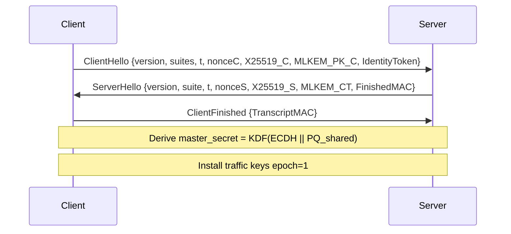

<div align="center">

# 🔐 NESTREN Protocol
### Post-Quantum Zero-Trust VPN Security Protocol (Go)


**Автор протокола и концепции:** `NESTREN`

</div>

---

## 🚀 Что это

**NESTREN Protocol** — это инновационный дизайн защищённого VPN-канала, ориентированный на:
- гибридную криптографию (**классическая + post-quantum**),
- строгую **Zero-Trust** аутентификацию сервисов и узлов,
- устойчивость к **MITM / replay / downgrade** атакам,
- **бесшовную ротацию ключей** без разрыва сессии,
- снижение сигналов для анализа трафика (padding, jitter, dummy packets).

> ⚠️ В репозитории представлена **reference-реализация** и архитектурный скелет на Go, который можно развивать в production-grade транспорт.

---

## 🧠 Модель угроз

Протокол проектируется против следующих классов атак:

1. **Пассивный перехватчик** (full packet capture).
2. **Активный MITM** (подмена рукопожатия, инъекция пакетов).
3. **Replay attacker** (повтор старых Hello/record).
4. **Downgrade attacker** (навязывание более слабого cipher suite или версии).
5. **Компрометация долгосрочного ключа** (требование PFS + быстрой ротации).
6. **Traffic analyst** (корреляция по размеру/таймингу/пустоте канала).

Допущения:
- доверенный bootstrap корень идентичности (trust root / CA / SPIFFE-like issuer),
- защищённые генераторы случайности на хостах,
- корректная реализация криптопримитивов в production-сборке.

---

## 🔬 Современный криптографический стек

### Базовый профиль (Hybrid-PQ-1)
- **KEX (гибрид):** `X25519 + ML-KEM (Kyber)`
- **AEAD:** `AES-256-GCM` (или `ChaCha20-Poly1305` для CPU без AES-NI)
- **Hash/KDF:** `SHA-256 / HKDF`
- **Identity signature:** `Ed25519`

### Почему гибрид
Даже если post-quantum компонент будет ослаблен в будущем, классический ECDH сохраняет безопасность на текущем горизонте (и наоборот). Это снижает крипториски миграционного периода.

---

## 🤝 Структура рукопожатия



### Защита в handshake
- **MITM:** MAC на transcript + проверка identity токена.
- **Replay:** timestamps + nonces + окно валидности.
- **Downgrade:** жёсткая проверка `version` и `suite` с привязкой к transcript.
- **PFS:** эпемерные X25519 ключи в каждой новой сессии/ротации.

---

## 📦 Формат защищённых пакетов

Фрейм записи:

```text
| type(1) | epoch(4) | seq(8) | len(2) | ciphertext+tag(variable) |
```

Свойства:
- `epoch` поддерживает бесшовную смену ключей,
- `seq` используется для anti-replay окна,
- `len` + padding скрывают реальный размер полезной нагрузки,
- AEAD защищает от подмены и повреждения.

---

## 🔁 Ротация ключей без разрыва

Используется **dual-epoch схема**:
1. Текущий ключ `epoch=N` остаётся активным.
2. Фоново вычисляется `next_key` для `epoch=N+1`.
3. Узлы начинают принимать оба эпохальных ключа в коротком overlap-окне.
4. После подтверждения перехода `epoch=N+1` становится текущим.

Это исключает packet loss на границе ротации и убирает необходимость renegotiation pause.

---

## 🛡 Zero-Trust аутентификация

Каждый узел предъявляет короткоживущий `IdentityToken`:
- `sub` (кто),
- `aud` (для кого),
- `iat/exp` (временное окно),
- `nonce` (уникальность),
- `sig` (подпись trust root).

На handshake проходит:
- верификация подписи,
- проверка аудитории,
- проверка сроков и anti-replay.

---

## 🌫 Устойчивость к анализу трафика

В протокол встроены механизмы обфускации:
- **Padding:** выравнивание размера до профиля (например, 512/1024/1280 байт).
- **Jitter:** случайный сдвиг интервалов отправки.
- **Dummy packets:** низкоинтенсивный cover traffic.

Это повышает цену корреляционных атак и снижает утечки метаданных.

---

## 🧱 Архитектура проекта на Go

```text
nestren-protocol/
├── cmd/
│   └── nestren-node/          # точка входа демонстрационного узла
├── internal/
│   ├── protocol/              # handshake + packet framing
│   │   ├── handshake.go
│   │   └── packet.go
│   ├── security/              # identity + rekey logic
│   │   ├── identity.go
│   │   └── rekey.go
│   └── traffic/               # obfuscation utilities
│       └── obfuscation.go
├── docs/
└── go.mod
```

---

## 🧩 Ключевые фрагменты кода

### 1) Hybrid handshake secret
```go
masterSecret, _ := protocol.DeriveHandshakeSecret(clientSK, serverPub, pqShared)
```
Объединяет `ECDH secret` и `PQ shared secret` в единый master secret.

### 2) Zero-Trust токен
```go
token.Sign(priv)
err := security.ValidateIdentityToken(token, pub, "nestren-control-plane", time.Now())
```
Подписывает и валидирует короткоживущую идентичность workload.

### 3) Seamless rekey
```go
r := security.RekeyState{CurrentEpoch: 1, CurrentKey: key1}
r.Rotate(masterSecret) // подготавливает epoch+1
```
Ротация выполняется без разрыва туннеля.

### 4) Traffic obfuscation
```go
delay := traffic.JitterDelay(20*time.Millisecond, 10*time.Millisecond)
dummy := traffic.ShouldSendDummy(20)
```
Добавляет шум в тайминг и фоновые пакеты.

---

## ⚙️ Эксплуатация под high-load

### Рекомендации по масштабированию
1. **Multi-core packet pipeline**
   - отдельные goroutine-пулы для decrypt/encrypt,
   - lock-free ring buffers между стадиями.

2. **NUMA-aware deployment**
   - закрепление worker-пулов по NUMA node,
   - локальность очередей + RSS/RPS балансировка.

3. **Batching + zero-copy**
   - батч-обработка UDP frames,
   - минимизация аллокаций (`sync.Pool`, preallocated buffers).

4. **Key management at scale**
   - централизованный control-plane для выдачи identity токенов,
   - staggered rekey расписание для избежания пиков CPU.

5. **Observability/SLO**
   - метрики: handshake latency, rekey success ratio, replay drops,
   - eBPF/pcap sampling только в безопасном режиме.

6. **DoS hardening**
   - stateless cookie до полной crypto-инициализации,
   - rate-limit на pre-auth и proof-of-work в edge-профиле.

---

## 🧪 Локальный запуск

```bash
go test ./...
go run ./cmd/nestren-node
```

---

## 📌 Дорожная карта для production

- Интеграция реальной PQ-библиотеки (ML-KEM/ML-DSA через audited backend).
- Формальная верификация state machine handshake.
- Встроенный anti-replay bitmap window для record layer.
- QUIC-like loss recovery profile для WAN сценариев.
- FIPS/ГОСТ профиль как опциональный build target.

---

## 📄 Лицензия

MIT (см. `LICENSE`).

---

<div align="center">

Designed with security-first mindset by **NESTREN**.

</div>
